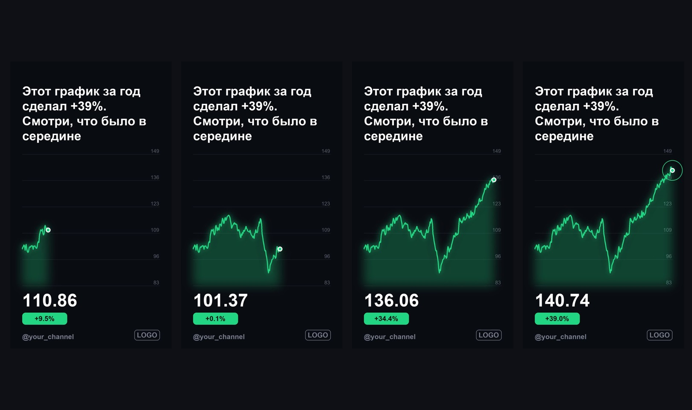

# shorts-factory

A pipeline that turns text or data into vertical 9:16 videos without a video editor: voice-over, animated frames, captions, rendered with ffmpeg.


## make_reel.py

Script in, reel out. Each line becomes a scene: neural TTS voices it, Pillow draws a styled frame with a slow zoom, ffmpeg glues scenes, audio and captions together.

```bash
pip install -r requirements.txt
python make_reel.py script.txt reel.mp4
```

## chart_short.py

Market or metric data in, a Shorts video out: the line chart draws itself, the hook text appears in the first second, the final value pops at the end. Built for a series of finance shorts where a new video is needed every day.



Both scripts run on a schedule, so a channel can publish every day with zero manual editing.
